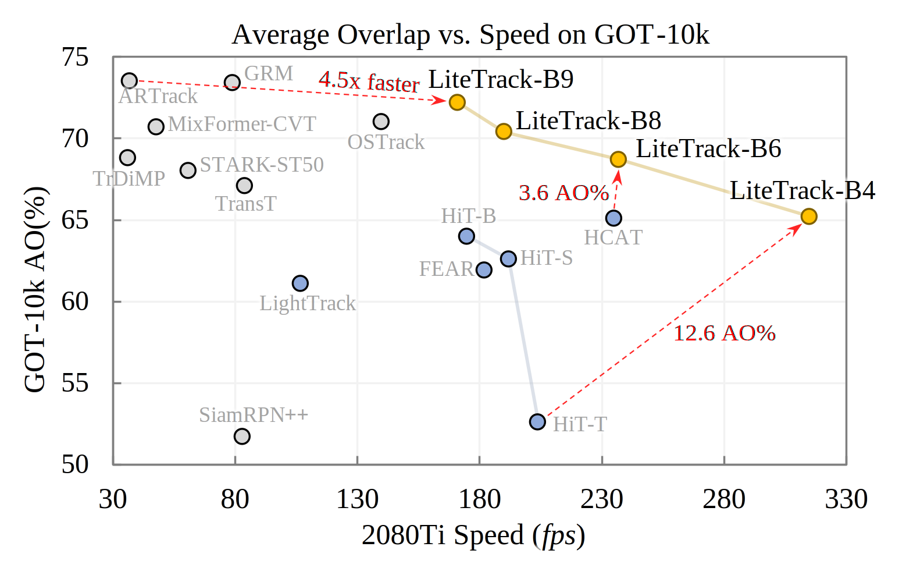

# LiteTrack
Making visual object tracking more efficient and faster.  

TODO list:
- [x] Release training and testing code.
- [ ] Release our trained models.
- [ ] Release onnx conversion and inference code. 
## Performance



<table class="tg">
<thead>
  <tr>
    <th class="tg-0pky"></th>
    <th class="tg-c3ow" colspan="3">Accuracy</th>
    <th class="tg-c3ow" colspan="5">FPS</th>
  </tr>
</thead>
<tbody>
  <tr>
    <td class="tg-0pky"></td>
    <td class="tg-c3ow">GOT-10k</td>
    <td class="tg-c3ow">LaSOT</td>
    <td class="tg-c3ow">TrackingNet</td>
    <td class="tg-c3ow">2080Ti</td>
    <td class="tg-c3ow">OrinNX</td>
    <td class="tg-c3ow">XavierNX</td>
    <td class="tg-c3ow">OrinNX(onnx)</td>
    <td class="tg-c3ow">XavierNX(onnx)</td>
  </tr>
  <tr>
    <td class="tg-0pky">LiteTrack-B9-3</td>
    <td class="tg-c3ow">72.2</td>
    <td class="tg-c3ow">67</td>
    <td class="tg-c3ow">82.4</td>
    <td class="tg-c3ow">171</td>
    <td class="tg-c3ow">21.4</td>
    <td class="tg-c3ow">16.2</td>
    <td class="tg-c3ow">64.75</td>
    <td class="tg-c3ow">37.15</td>
  </tr>
  <tr>
    <td class="tg-0pky">LiteTrack-B8-3</td>
    <td class="tg-c3ow">70.4</td>
    <td class="tg-c3ow">66.4</td>
    <td class="tg-c3ow">81.4</td>
    <td class="tg-c3ow">190</td>
    <td class="tg-c3ow">24.81</td>
    <td class="tg-c3ow">18.1</td>
    <td class="tg-c3ow">69.97</td>
    <td class="tg-c3ow">40.07</td>
  </tr>
  <tr>
    <td class="tg-0pky">LiteTrack-B6-3</td>
    <td class="tg-c3ow">68.7</td>
    <td class="tg-c3ow">64.6</td>
    <td class="tg-c3ow">80.8</td>
    <td class="tg-c3ow">237</td>
    <td class="tg-c3ow">31.5</td>
    <td class="tg-c3ow">20.5</td>
    <td class="tg-c3ow">82.53</td>
    <td class="tg-c3ow">50.61</td>
  </tr>
  <tr>
    <td class="tg-0pky">LiteTrack-B4-2</td>
    <td class="tg-c3ow">65.2</td>
    <td class="tg-c3ow">62.5</td>
    <td class="tg-c3ow">79.9</td>
    <td class="tg-c3ow">315</td>
    <td class="tg-c3ow">44.1</td>
    <td class="tg-c3ow">25.3</td>
    <td class="tg-c3ow">101.98</td>
    <td class="tg-c3ow">66.94</td>
  </tr>
  <tr>
    <td class="tg-0pky">HiT-B</td>
    <td class="tg-c3ow">64.0</td>
    <td class="tg-c3ow">64.6</td>
    <td class="tg-c3ow">80.0</td>
    <td class="tg-c3ow">175(Not Tested)</td>
    <td class="tg-c3ow"></td>
    <td class="tg-c3ow"></td>
    <td class="tg-c3ow"></td>
    <td class="tg-c3ow"></td>
  </tr>
  <tr>
    <td class="tg-0pky">OSTrack</td>
    <td class="tg-c3ow">71.0</td>
    <td class="tg-c3ow">69</td>
    <td class="tg-c3ow">83.1</td>
    <td class="tg-c3ow">140</td>
    <td class="tg-c3ow">17.99</td>
    <td class="tg-c3ow">12.08</td>
    <td class="tg-c3ow">50.72</td>
    <td class="tg-c3ow">30.89</td>
  </tr>
</tbody>
</table>

## Prepare Environment

Ensure that you have install the `pytorch` >= 1.8.1 and corresponding `torchvision` version.  It doesn't matter whether you use pip or conda.

Then execute
```sh
bash install.sh
```
You can check the script where I install the `opencv-python-headless` library because of my headless server environment.  If you are running in a machine with GUI, you can comment that out.

## Set project paths
Run the following command to set paths for this project
```
python tracking/create_default_local_file.py --workspace_dir . --data_dir ./data --save_dir ./output
```
After running this command, you can also modify paths by editing these two files
```
lib/train/admin/local.py  # paths about training
lib/test/evaluation/local.py  # paths about testing
```

## Training and Evaluation on Datasets
We support training following [OSTrack](https://github.com/botaoye/OSTrack).
### Dataset Preparation
Put the tracking datasets in ./data. It should look like this:
```
${PROJECT_ROOT}
 -- data
     -- lasot
         |-- airplane
         |-- basketball
         |-- bear
         ...
     -- got10k
         |-- test
         |-- train
         |-- val
     -- coco
         |-- annotations
         |-- images
     -- trackingnet
         |-- TRAIN_0
         |-- TRAIN_1
         ...
         |-- TRAIN_11
         |-- TEST
``` 
### Training
Download pre-trained [CAE ViT-Base weights](https://github.com/lxtGH/CAE)(cae_base.pth) and put it under  `$PROJECT_ROOT$/pretrained_models`.   
> **NOTE**: ViT in CAE is slightly different from the original ones (in Image is worth 16x16 words and MAE), e.g., projections of Q,K,V and layer scale.  Details can be seen in the code.

Run the command below to train the model:
```sh
# single GPU
python tracking/train.py --script litetrack --config B8_cae_center_got10k_ep100 --save_dir ./output --mode single  --use_wandb 0

# 2 GPUs
python tracking/train.py --script litetrack --config B8_cae_center_got10k_ep100 --save_dir ./output --mode multiple --nproc_per_node 2  --use_wandb 0
```
- If you want to use wandb to record detailed log and get clear curve of training, set `--use_wandb 1`.  
- The batch size, learning rate and the other detailed parameters can be set in config file, e.g., `experiments/litetrack/B6_cae_center_got10k_ep100.yaml`.
- In our implemention, we always follow `batch_size` $\times$ `num_GPU` $\div$ `learning_rate` $= 32 \times 1 \div 0.0001$ for alignment with OSTrack.  For example, if u use 4 GPUs and bs=32 (in each GPU), then the lr should be 0.0004. 
- If you are using an Ampere GPU (RTX 30X0), we suggest you upgrade pytorch to `2.x` to get free boost on attention computation, which will save about half of the GPU memory so that u can enable batch size up to 128 in one single RTX 3090 (it costs <19 G memory with AMP).
- We save the checkpoints without optimization params in the last 20% epochs, for testing over these epochs to avoid accuracy jittering.

### Evaluation
Use your own training weights or ours in `$PROJECT_ROOT$/output/checkpoints/train/litetrack`.  
Some testing examples:

- LaSOT
(cost ~2 hours on 2080Ti with i5-11400F for one epoch testing)
```sh
python tracking/test.py litetrack B6_cae_center_all_ep300 --dataset lasot --threads 8 --num_gpus 1 --ep 300 299 290
python tracking/analysis_results.py # need to modify tracker configs and names
```
For other off-line evaluated benchmarks, modify --dataset correspondingly.

- GOT10K-test (cost ~7 mins on 2080Ti with i5-11400F for one epoch testing)
```sh
python tracking/test.py litetrack B6_cae_center_got10k_ep100 --dataset got10k_test --threads 8 --num_gpus 1 --ep 100 99 98
python lib/test/utils/transform_got10k.py --tracker_name litetrack --cfg_name B6_cae_center_got10k_ep100_099 # the last number is epoch
```
- TrackingNet (cost ~1 hour on 2080Ti with i5-11400F for one epoch testing)
```sh
python tracking/test.py litetrack B6_cae_center_all_ep300 --dataset got10k_test --threads 8 --num_gpus 1 --ep 300 299
python lib/test/utils/transform_trackingnet.py --tracker_name litetrack --cfg_name B6_cae_center_all_ep300_300 # the last number is epoch
```
